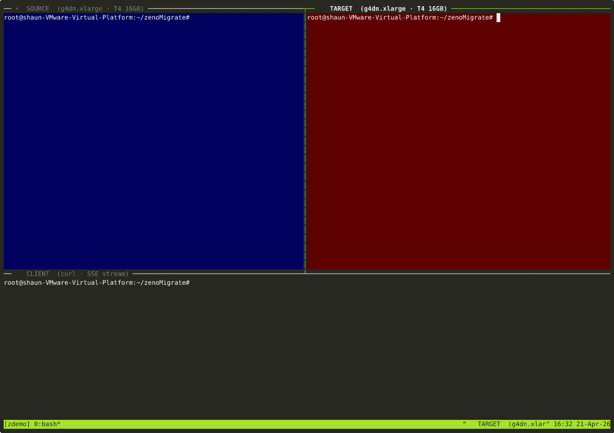

# libccmc

**Connection-Centric Micro-Checkpoint** — migrate live TCP connections across hosts without RST or FIN.

libccmc exports the kernel state of an ESTABLISHED TCP socket into an 80-byte structure using the Linux `TCP_REPAIR` mechanism, and restores it on any other host. The migrated socket is immediately live on the target — no SYN handshake, no client reconnection, no data loss.



📖 [Read the full engineering deep-dive on Dev.to](https://dev.to/sunchao_dong/i-froze-a-tcp-connection-for-10-minutes-and-migrated-it-to-another-server-31i8)

```
Source host                         Target host
────────────────                    ────────────────
ccmc_tiocoutq_poll(fd)
ccmc_freeze_and_extract(fd, &st)  ──→  (send st over any channel)
close(fd)                               new_fd = ccmc_socket_restore(&st)
                                        // new_fd is a live ESTABLISHED socket
```

## Motivation

A running TCP connection is not bound to a process or a machine — it is defined by a 4-tuple and a handful of kernel sequence numbers. libccmc makes this explicit: the entire transport-layer identity of a connection fits in 80 bytes.

| Checkpoint approach | Size | Cold-start delay |
|---|---|---|
| CRIU (full process) | ~5 MB | 30–60 s |
| **libccmc (CCMC)** | **80 bytes** | **< 1 ms** |

Practical use cases:

- **Spot/preemptible instance migration**: move an in-flight LLM inference session from a reclaimed instance to a standby before the 2-minute eviction window closes.
- **Live service rebalancing**: drain a connection from an overloaded node to an idle one without the client noticing.
- **Zero-downtime host maintenance**: evacuate all connections before rebooting.

## Requirements

- Linux kernel ≥ 3.11 (`TCP_REPAIR` support)
- Linux kernel ≥ 3.17 (`TCP_TIMESTAMP` for PAWS cross-machine continuity)
- `CAP_NET_ADMIN` (root) for `TCP_REPAIR` `setsockopt` calls
- GCC ≥ 9 for the C library
- Python ≥ 3.10 for the Python bindings
- libbpf + clang ≥ 12 for the optional eBPF companion programs

## Build

```bash
# Shared library + static library
make

# Example programs (examples/sse_server, examples/gateway)
make examples

# Test helpers
make tests

# eBPF XDP + TC programs (requires clang + libbpf)
make ebpf
```

Outputs land in `build/`:

```
build/
├── libccmc.so      ← shared library
├── libccmc.a       ← static library
├── sse_server      ← example: SSE streaming server with migration
├── gateway         ← example: SSE proxy with Graceful Drain
├── tcp_echo_server
├── client_verifier
└── dummy_llm_server
```

## Quick start

### Run the tests

```bash
# Core TCP_REPAIR validation (requires root)
sudo bash tests/test_tcp_repair.sh

# E2E SSE streaming migration across 2 hops (requires root)
sudo bash tests/test_sse.sh
```

Expected output for `test_tcp_repair.sh`:

```
── Step 4: ccmc_freeze_and_extract (assertion ②) ──────────────
  Captured ccmc_state (80 bytes):
    local       = 127.0.0.1:36970
    remote      = 127.0.0.1:19090
    send_seq    = 1353560747
    ts_enabled  = 1  tsval=3910332244
  ✓ [send_seq!=0]
  ✓ [post_restore_write_ok]
  ✓ [server_received_magic]

 ✅ PASS — TCP_REPAIR works on real loopback
```

### Link against libccmc

```c
#include <ccmc.h>

// Source side
struct ccmc_state st;
ccmc_tiocoutq_poll(fd, 2000);          // wait until all bytes ACKed
ccmc_freeze_and_extract(fd, &st, sizeof(st));
st.token_index = my_app_cursor;        // optional: stamp app-level cursor
close(fd);                             // silent — no RST sent

// ... transmit &st to target (80 bytes) ...

// Target side
int new_fd = ccmc_socket_restore(&st, sizeof(st));
// new_fd is ESTABLISHED, ready to write
```

Compile:

```bash
gcc -O2 -I./include myapp.c -L./build -lccmc -o myapp
```

## API reference

All functions require `CAP_NET_ADMIN` except `ccmc_tiocoutq`.

### `ccmc_tiocoutq(fd)`

Returns the number of unacknowledged bytes in the kernel TCP send buffer (`snd_nxt − snd_una`). Returns −1 on error.

Use this to check whether it is safe to freeze: a return value of 0 means every sent byte has been ACKed by the peer.

### `ccmc_tiocoutq_poll(fd, timeout_ms)`

Spin-polls `TIOCOUTQ` every 1 ms until the send buffer drains or `timeout_ms` elapses. Returns 0 on clean drain, −1 on timeout (`errno = ETIMEDOUT`) or ioctl error.

This is the **flush barrier** — call it immediately before `ccmc_freeze_and_extract` to guarantee the TCP sequence number sits exactly on an application-layer frame boundary.

### `ccmc_freeze_and_extract(fd, buf, buf_size)`

Enters `TCP_REPAIR` mode on `fd` and captures the full connection state into `buf`. After this call:

- The socket is frozen. The kernel discards it silently on `close()` — no FIN or RST is sent.
- `buf` contains a `struct ccmc_state` (80 bytes) ready to transmit.

`buf_size` must be ≥ `sizeof(struct ccmc_state)`. Returns 0 on success, −1 on error.

### `ccmc_socket_restore(buf, buf_size)`

Creates a new socket, restores all sequence numbers, window parameters, MSS, and TCP timestamp offset from `buf`, then exits `TCP_REPAIR` mode. Returns the new live socket fd on success, −1 on error.

The caller is responsible for `close()`-ing the returned fd.

### `ccmc_freeze_batch(fds, n, states_buf, state_size)`

Freezes `n` sockets in a single C loop without returning to user space between each freeze. Minimises inter-freeze jitter (~10 µs per socket). Each slot in `states_buf` (`states_buf[i * state_size]`) receives the captured state for `fds[i]`.

Returns 0 if all freeze operations succeeded. Returns −1 on first error; remaining fds are still attempted to avoid leaving sockets in a mixed state.

## `struct ccmc_state` (80 bytes)

```c
struct ccmc_state {
    struct sockaddr_in       local_addr;     //  0  16 B — source IP:port
    struct sockaddr_in       remote_addr;    // 16  16 B — client IP:port
    uint32_t                 send_seq;       // 32   4 B — TCP snd_nxt
    uint32_t                 recv_seq;       // 36   4 B — TCP rcv_nxt
    struct tcp_repair_window repair_window;  // 40  20 B — window parameters
    int                      mss;           // 60   4 B — negotiated MSS
    struct ccmc_ts_state     ts;            // 64  12 B — PAWS timestamp state
    int                      token_index;  // 76   4 B — app-level cursor
};
```

The `token_index` field is set to 0 by `ccmc_freeze_and_extract`. The caller may overwrite it to carry an application-level cursor (e.g., the last completed LLM token index) alongside the transport state.

### Cross-machine PAWS continuity

The `ts` field captures the source machine's `tcp_time_stamp_raw()` at freeze time. On restore, `ccmc_socket_restore` calls `setsockopt(TCP_REPAIR_OPTIONS, TCPOPT_TIMESTAMP, tsval)` which sets:

```
tp->tsoffset = tsval − tcp_time_stamp_raw(target)
```

Every subsequent outgoing packet carries `TSVAL = tcp_time_stamp_raw(target) + tsoffset`, which is always ≥ the source's last TSVAL. The peer's PAWS check passes without modification.

## eBPF companion (`ebpf/`)

The eBPF programs implement a **zero-window connection hold** for the migration window. They are optional — you can use libccmc without them — but they extend the safe freeze window from the kernel's default TCP timeout (~minutes) to indefinitely.

### State machine

```
INACTIVE ──► ARMED ──► FROZEN ──► RELEASED
```

| State | TC egress | XDP ingress |
|---|---|---|
| `INACTIVE` | pass-through | pass-through |
| `ARMED` | rewrite `window = 0` on all outgoing segments | pass-through |
| `FROZEN` | rewrite `window = 0` | intercept all packets; reply with zero-window ACK; buffer payloads |
| `RELEASED` | pass-through | pass-through |

**`ARMED`**: the peer's send window shrinks to zero over one RTT, stopping new inbound data while existing data drains — this is the flush barrier at the network level.

**`FROZEN`**: the XDP program constructs and transmits a zero-window ACK for every incoming packet, keeping the client's TCP stack in persist-timer mode indefinitely. Payload data arriving during the freeze is stored in a BPF queue map (`zeno_deep_buf`, up to 4096 × 1600 bytes). On migration completion these buffered payloads can be replayed into the restored socket — zero client data loss.

```bash
# Build eBPF objects (requires clang ≥ 12 and libbpf)
make ebpf

# Load XDP program (replace ens5 with your interface)
ip link set dev ens5 xdp obj ebpf/xdp_zerowin.bpf.o sec xdp

# Load TC egress program
tc qdisc add dev ens5 clsact
tc filter add dev ens5 egress bpf da obj ebpf/tc_egress.bpf.o sec tc
```

Session state is controlled via the `zeno_sessions` BPF hash map (keyed on 4-tuple `flow_key`). Update the `state` field of a `session_state` entry to transition through the state machine.

## Python bindings (`python/ccmc.py`)

```python
from ccmc import CCMC

lib = CCMC("build/libccmc.so")

# Source side
lib.tiocoutq_poll(fd, timeout_ms=2000)
state_bytes = lib.freeze_and_extract(fd, token_index=42)

# Target side
new_fd = lib.socket_restore(state_bytes)

# Inspect captured state
st = CCMC.parse_state(state_bytes)
print(st.summary())
# → 10.0.1.5:54321→10.0.1.2:8000 send_seq=4012847123 mss=1460 tsval=991234 token=42

# Bulk freeze (N concurrent connections)
states = lib.freeze_batch([fd0, fd1, fd2, fd3])
```

## Repository structure

```
libccmc/
├── include/
│   └── ccmc.h              ← public API (structs + function declarations)
├── src/
│   └── ccmc.c              ← core implementation
├── ebpf/
│   ├── include/
│   │   ├── zeno_common.h   ← state machine, flow_key, session_state
│   │   ├── zeno_proto.h    ← packet parsers
│   │   └── zeno_checksum.h ← incremental checksum helpers
│   ├── xdp_zerowin.bpf.c  ← XDP: ingress intercept + deep buffer
│   ├── tc_egress.bpf.c     ← TC: egress zero-window rewrite
│   └── Makefile
├── examples/
│   ├── sse_server.c        ← SSE streaming server with CCMC export/import
│   └── gateway.c           ← SSE proxy with Graceful Drain + Unix socket ctl
├── tests/
│   ├── helpers/
│   │   ├── tcp_echo_server.c
│   │   ├── client_verifier.c
│   │   └── dummy_llm_server.c
│   ├── test_tcp_repair.sh  ← core validation (requires root)
│   └── test_sse.sh         ← E2E SSE migration (requires root)
├── python/
│   └── ccmc.py             ← ctypes bindings
└── Makefile
```

## License

```
src/          Apache License 2.0
include/      Apache License 2.0
examples/     Apache License 2.0
tests/        Apache License 2.0
python/       Apache License 2.0

ebpf/         GNU General Public License v2.0 only
              (BPF programs loaded into the Linux kernel must be GPL-compatible)
```

See [LICENSE](LICENSE) and [LICENSE-APACHE](LICENSE-APACHE) for full texts.

## Author

Sunchao Dong — 2026
